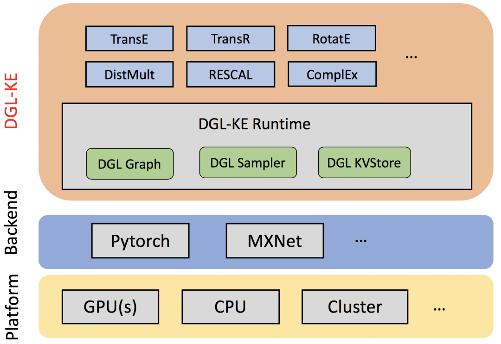
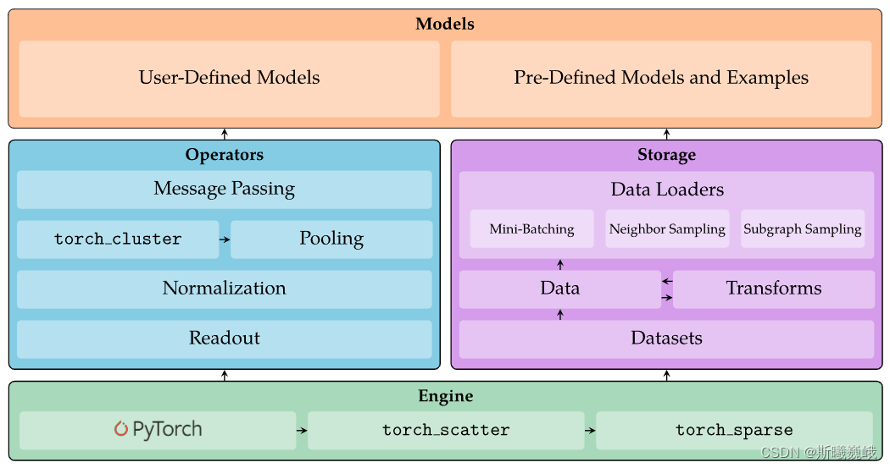
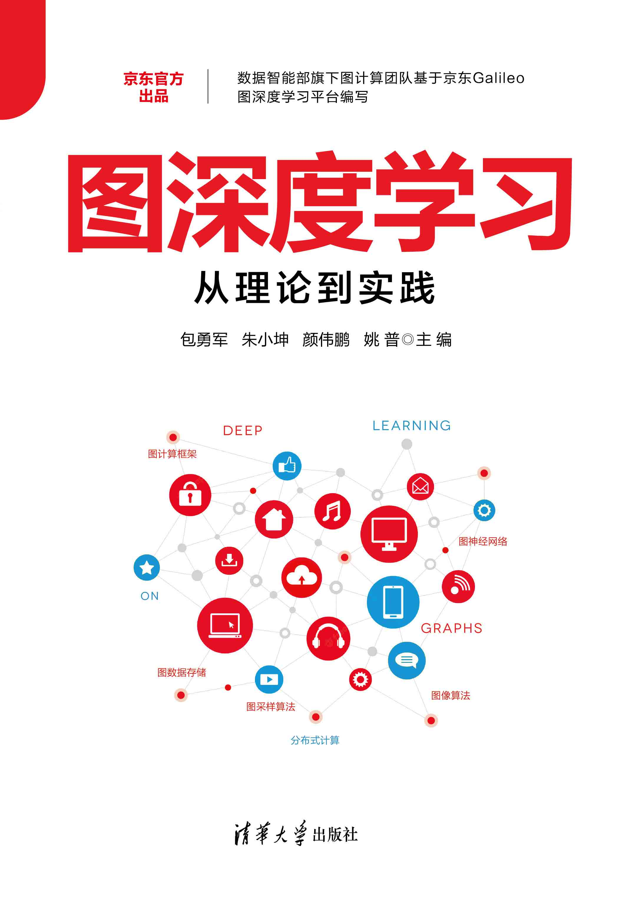

# Resume LuckyBoy
# 知乎主页
https://www.zhihu.com/people/xiao-pu-21-16   
# CSDN主页
https://blog.csdn.net/Jerry_ICCAS  
# 稀土掘金
https://juejin.cn/user/3477073687483324   
# Github地址
https://github.com/LuckBoyPhd  

# 微信公众号

## 教育背景
2015-2020  中国科学院化学研究所      理学博士  
2011-2015  北京化工大学 高分子材料与工程 工学学士 

## 工作
2020 - JD.COM 图算法平台负责人  

## 深度学习框架能力
Pytorch 深度学习框架的使用，Pytorch算子的二次开发,多GPU 的Pytorch算子开发。PyG和DGL等图学习框架。能够依据业务需要，设计算子，实现模型。 

基于A100 GPU架构的图深度框架研发 
构建基于A100 GPU的图训练解决方案，支持超大图，图存储、游走、采样、训练，落地百亿/千亿超大规模图深度学习平台，实现业务落地。基于多机多卡分布式技术支撑扩展图规模到20亿; 基于A100硬件加速能力降低图训练耗时至天级别，在CUDA上实现图高效的采样操作和图特征聚合操作，游走类算子操作。 

## 出版《图深度学习从理论到实践》专著

企业影响力打造，沉淀和传播图算法业界知识 ,图计算的知识推广性强，由浅入深，便于各类人员学习掌握 , 应用价值高，典型应用实例  
书本地址: https://item.jd.com/13167491.html  

# 书的代码开源内容参考
https://datawhalechina.github.io/grape-book

## 图算法的专栏
https://www.zhihu.com/column/c_1584340115077484544  

## 大模型的介绍
https://www.zhihu.com/column/c_1676193405808640000  

## 综述
时间序列综述:https://zhuanlan.zhihu.com/p/658811257  
冷启动商品推荐综述：https://zhuanlan.zhihu.com/p/658806393   
知识图谱应用场景综述 https://zhuanlan.zhihu.com/p/658581563  

## 参与英伟达语音对话机器人分享
https://zhuanlan.zhihu.com/p/644120716  

## 研究成果

## Publication
[1] .Pu Yao， Lukun Feng， Hongxia Guo， Combined Molecular Dynamics Simulation and Extended Rouse Model Analysis of Static and Dynamic Properties of Unentangled Polymer Melts with Different Chain Architectures， Chinese Journal of Polymer Science  
[2] Yedi Li,Pu Yao, Non-Rouse behavior of short ring polymers in melts by molecular dynamics simulations, SoftMatter, 2023  
[3] Pu Yao, Lukun Feng, Yedi Li, HongxiaGuo, Multiscale approach to  equilibrating polymer melts by force fields with same Flory characteristic ratio as the  standard KG potential 

## 专利
[1] 一种采用变力场分子动力学方法实现缠结粗粒化高分子熔体平衡模型构建的方法.  
[2] 一种融合协同过滤与图算法的推荐方法  
[3] 一种基于属性信息增强的图神经网络缓解冷启动的推荐算法   
[4] 一种基于元学习和图生成对抗网络的动态非均衡图分类方法  
[5] 一种基于逐点温度系数的图神经网络知识蒸馏方法 

## 软件著作权
[1] 基于 GPU的 GAPS缠结高分子动力学模拟软件 [GAPS][V1.0]2019SR0050680  
[2] 基于贪心算法的缠结网络分析软件 [GENA][V1.0] 2020SR0045868  
[3] 九数深度学习图平台1.0 2022SR1566505  

## 获奖
[1] 2012 北京市大学生数学竞赛 三等奖  
[2] 2012 全国大学生物理竞赛 三等奖  
[3] 2013 高教社杯数学建模竞赛 北京市二等奖  
[4] 2014 国家励志奖学金  
[5] 2017-2018 连续两次获得中国科学院大学三好学生  
[6] 2019 中科院化学所青年科学家优秀奖  

# 编程技能
## 基础编程能力
熟悉 C++/Python 编程，Pybind11 C++。熟悉 Scipy  
## 深度学习框架二次开发能力
PyTorch 深度学习框架，能够完成算子定制二次开发。  
## 模型开发能力
Pytorch 深度学习框架的使用，Pytorch算子的二次开发,多GPU 的Pytorch算子开发。 
## 图开发能力
PyG和DGL等图学习框架。能够依据业务需要，设计算子，实现模型。 
## 大数据部署能力
分布式数据数据存储的能力：HADOOP 分布式文件读取系统。了解 Linux/Shell/Docker 等，能够独立完成工程实现和部署。 

## Experience

## Publications

git init   
git add README.md   
git add .   
git commit -m "first commit"  
git branch -M main  
#git remote add origin https://github.com/LuckBoyPhd/Resume.git  
git push -u origin main  
https://markdown.com.cn/basic-syntax/paragraphs.html   